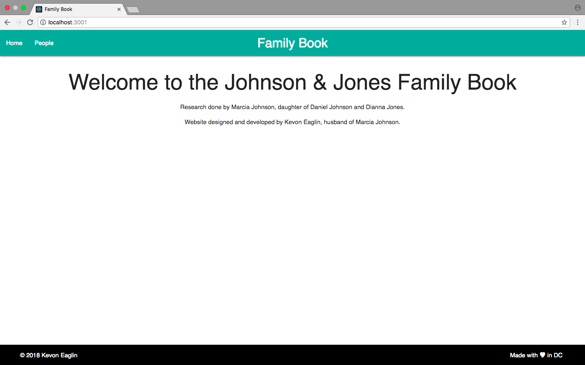
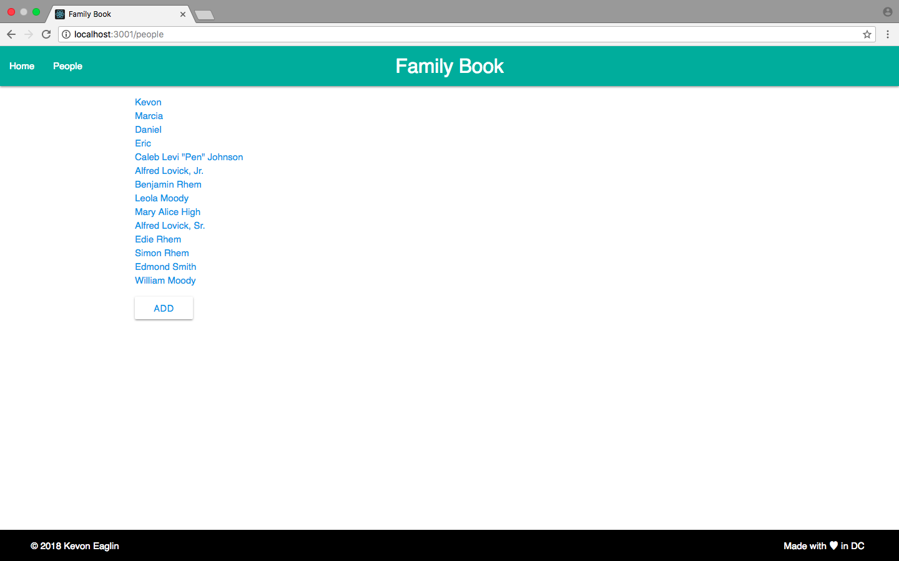
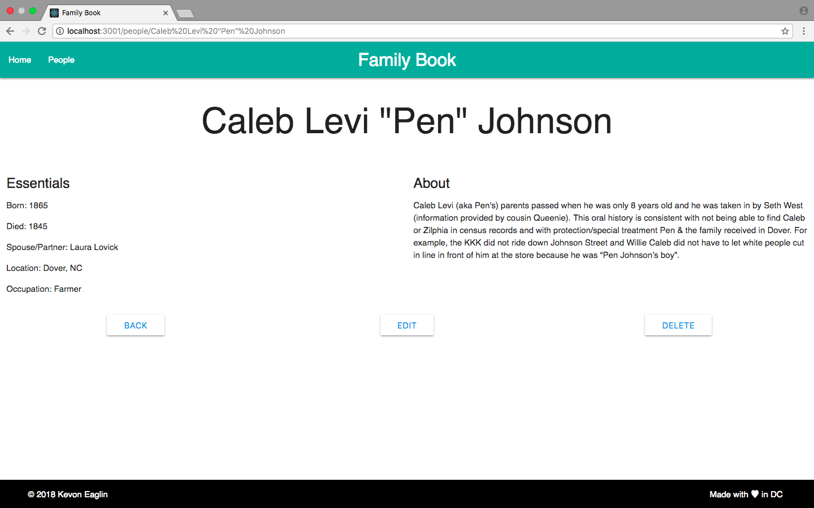

# Johnson and Jones Family Book  
### A living archive of familial and ancestral history and stories.  
   

## Project Status
This project is still being actively developed. 
- Add images
- Form data verification
- "Scroll through history" idea
- Multiple views (scroll plus family tree or something)
- User model and login functionality
- User authorizations for add, update and delete methods

#### Tech Stack
- React  
- Node  
- ExpressJS   
- MongoDB    
Data modeled with MongooseJS  
Client deployed to Surge  
Server deployed to Heroku  
Cloud DB set up with mLab  

<!-- #### Resources
- [codrops](https://tympanus.net/codrops/css_reference/)  
- [Materialize](http://next.materializecss.com/)  
- [whenpresident](https://github.com/keaglin/whenpresidentexercise) (from following in class)  

## Project Screen Shots

 -->

## Usage Instructions
Wanna fork or run it yourself? 
#### Prerequisites
You will need `npm`, `node` (and optionally `yarn`) installed globally on your machine.  
### Install and Setup
**Using `npm`**  
1. Clone down this repository  
2. Run `npm install`  
3. Start Server with `npm run start`   
4. Visit App at `localhost:3000`  
5. Build with `npm run build`  
6. Deploy `/build` with any tool or service that supports static sites  

**Using `yarn`**  
1. Clone down this repository  
2. Run `yarn install`  
3. Start Server with `yarn start`   
4. Visit App at `localhost:3000` 
5. Build with `yarn build` (generates a static site in the `/build` folder in the project root)  
6. Deploy `/build` with any tool or service that supports static sites

<!-- ## Reflection

#### About 
This was initially a project built over 3 days to wrap up Unit 2 of my Web Development Immersive cohort at General Assembly DC. I built it to demonstrate knowledge of backend engineering techniques learned during Unit 2.  
I initially set out to build an API with a separate frontend (which I've now done as of this writing on 3/6/18). The project was inspired by my wife's idea to make and bind a physical book. I thought a website would make the information more accessible and easier to disseminate.  
#### Technologies Used
I used the MERN (Mongo, Express, React, Node) stack to build this project because it's what we've been using so it was easy to translate to my use case for this project. I initially wanted to use Pug because I had positive experiences with Pug (when it was Jade) in the past but I severely underestimated how much time I spent reading documentation and experimenting to get things functional, especially with regard to passing in data from my controller. With the time given, I decided to switch back to Handlebars because I could accomplish the same functionality and hit my deadline.  
This app was previously deployed as a MEHN app to Github Pages but I used Surge for the React app because it's quick and easy. Github Pages is excellent for static sites but I needed a hosted backend for this particular project so Heroku was an easy choice. I used mLab to host the database and used an environmental variable to connect it. -->